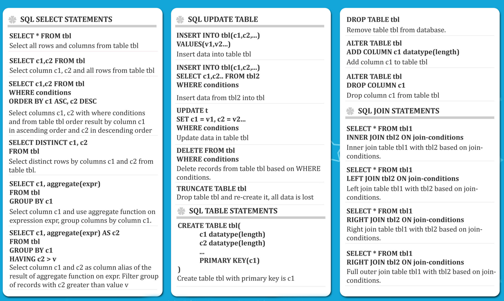

# SQL LECTURES

## COURSE MODULES
| Module                          | Parts  |                                  |
|---------------------------------|--------|----------------------------------|
| [help with pgadmin](pgadmin.md) | 0      |                                  |

## DEFINITIONS
* `Databases` are systems that allow users to store and organize data
	* They are useful when dealing with large amounts of data

## SPREADSHEETS VS DATABASES
* spreadsheets
	* one-time analysis
	* quickly need to chart something out
	* reasonable data set size
	* ability for untrained people to work with data
* databases
	* data integrity
	* can handle masive amounts of data
	* quickly combine different datasets
	* automate steps for re-use
	* can support data for websites and applications

# SELECT
* `SELECT` is the most common statement used, and it allows us to retrieve information from a table
    * `SELECT column_name FROM table_name`
* we can combine `SELECT` with other statements to perform more complex queries

# SELECT DISTINCT
* get only **distinct** values
	* `SELECT DISTINCT column FROM table`
	* `SELECT DISTINCT(column) FROM table`
* ex: see table

| name    | choice  |
|---------|---------|
| Zach    | green   |
| David   | green   |
| Claire  | yellow  |
| David   | Red     |

* `SELECT DISTINCT name FROM table`
	* Zach, David, Claire
* `SELECT DISTINCT choice FROM table`
	* green, yellow, red

# COUNT
* returns number of inpt rows that match a specific condition
* count needs function
	* `SELECT COUNT(name) FROM table`
	* count: 4
* `SELECT COUNT(DISTINCT name) FROM table`
	* count = 3 *because zack + david + claire = 3*

# SELECT WHERE
* `WHERE` allows us to specify conditions on columns for the rows to be returned